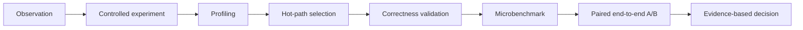

# LLM Inference Optimization and Serving Engine Lab

Reproducible llama.cpp CPU profiling, hot-path optimization,
and deterministic LLM serving-engine simulation
**Quantization, KV Cache, CPU Profiling, and Hot-Path Optimization**

## Overview

This repository is a reproducible CPU LLM inference performance study built around [llama.cpp](https://github.com/ggml-org/llama.cpp) pinned at commit `e3546c7948e3af463d0b401e6421d5a4c2faf565` and Qwen2.5-0.5B-Instruct GGUF models. It covers reproducible benchmarking, prefill/decode characterization, F16/Q8_0/Q4_K_M comparison, KV-cache and context scaling, Linux `perf` profiling, assembly inspection, AVX2/F16C kernel experiments, and paired end-to-end A/B validation.

The central result is deliberately nuanced: a selected Q8_0 tile optimization was bit-identical and 1.32x–1.34x faster in an extracted microbenchmark, but a noisy 20-pair end-to-end experiment did not establish a stable application-level gain. No unsupported end-to-end speedup is claimed.

## Why this project

Why can a smaller quantized model be slower than F16 on a specific CPU and workload? This project treats that as an empirical systems question:



The workflow separates observation, hypothesis, and verified conclusion so that negative and inconclusive outcomes remain useful engineering evidence.

## Key results

| Evidence | Result | Scope |
| --- | --- | --- |
| Measured result | Phase 4 prefill means: **48.556–194.256 tokens/s** across matched thread-scaling rows | Q4_K_M, prompt 128/1024, 1–8 threads |
| Measured result | Phase 4 generation means: **14.214–47.894 tokens/s** across matched thread-scaling rows | Same rows and host |
| Measured result | F16 / Q8_0 / Q4_K_M files: **1,266,425,696 / 675,710,816 / 491,400,032 bytes** | Exact GGUF artifacts |
| Measured result | Q8_0 was **46.64% smaller** and Q4_K_M **61.20% smaller** than F16 | File storage, not runtime memory |
| Profiling result | Q8_0 executed **24.3% more instructions** than F16 | Matched whole invocation |
| Profiling result | Q4_K_M executed **56.7% more instructions** than F16 | Matched whole invocation |
| Profiling result | Q8_0 `tinyBLAS_Q0_AVX` accounted for **56.39%** of samples | Primary sampled workload |
| Local microbenchmark | Extracted Q8_0 RN=2 tile improved **1.32x at depth 28** and **1.34x at depth 152** | Not an end-to-end speedup |
| End-to-end result | Prompt paired median **-1.571%**, bootstrap 95% CI **[-3.538%, +2.252%]** | 20 pairs; material drift; **inconclusive** |

See the [final technical report](docs/final_report.md) for interpretation and links to the complete result tables.

## Mini LLM Serving Engine

**Evidence: SIMULATED.** The repository also contains a deterministic C++17 serving-engine simulator with a dependency-free native core and Python workload/analysis tools:

```text
JSONL workload -> validation/TSV -> FCFS or continuous batching
  -> block KV + exact prefix cache -> request/iteration records
  -> TTFT / P95 / P99 / throughput / goodput analysis
```

Implemented features include deterministic request replay, single-active FCFS, continuous `DecodeFirst` and `FcfsMixed` scheduling, sequence/token budgets, block KV capacity, exact-token full-block prefix reuse, collision verification, reference counts, deterministic LRU, and workload-driven service metrics. Representative synthetic results illustrate the evidence boundary:

| Configuration | Evidence | Completed | Request/s | P99 TTFT (us) | Prefix token hit rate |
| --- | --- | ---: | ---: | ---: | ---: |
| FCFS chat | SIMULATED | 8 | 68.94 | 946 | N/A |
| Continuous chat | SIMULATED | 8 | 67.97 | 521 | N/A |
| Shared-prefix cache on | SIMULATED | 8 | 110.69 | 536 | 0.88 |
| Eight-block KV pool | SIMULATED | 1/12 | 605.69* | 256 among completed | N/A |

`*` The rate uses the one completed request's full-drain window; the run then
stalled with 11 unfinished requests, so it is not a successful-capacity result.

Quick start:

```bash
python3 -m venv .venv
.venv/bin/python -m pip install -r requirements.txt
cmake --preset debug
cmake --build --preset debug -j
scripts/run_serving_demo.sh
# Full validation, still without models or network access:
scripts/verify_serving_project.sh
```

Portable serving provenance records repository files relative to the repository root,
uses symbolic temporary paths, and hashes the exact configuration, workload, and
native runner. Normal runs write below ignored `.artifacts/serving/`; updating the
checked-in SIMULATED reference requires explicit `--update-reference`.

Read the [serving final report](docs/serving/final_report.md), [architecture](docs/serving/architecture.md), and [interview notes](docs/serving/interview_notes.md). The simulator has no tensors, tokenizer, real accelerator execution, networking, preemption, swapping, chunked prefill, or performance parity claim. It complements the earlier real llama.cpp CPU profiling work: that work measures kernels and binaries; this layer studies deterministic serving-policy interactions.

## Main engineering conclusions

- Smaller GGUF files did not automatically produce higher CPU throughput.
- Prefill and decode scaled differently with CPU threads.
- Larger allocated context increased RSS and reduced observed throughput under the tested configuration.
- Q8_0 and Q4_K_M executed more instructions than F16 in matched whole-invocation workloads; their higher IPC did not offset the instruction-count increase.
- A local kernel optimization can show a large microbenchmark gain without a statistically stable end-to-end gain.
- A negative or inconclusive optimization result is useful when correctness, binary provenance, and statistical evidence are preserved.

These conclusions describe this environment and workload; they do not establish that F16 is generally faster than quantized inference.

## Project architecture

```text
.
├── benchmarks/             # runners, analyzers, and result normalization
├── configs/                # reproducible workload matrices and model manifests
├── docs/
│   └── results/            # tracked phase reports
├── kernels/                # extracted C++17 correctness and timing harnesses
├── patches/                # exported llama.cpp experiment patch
├── scripts/                # model, build, and perf-environment utilities
├── tests/                  # CTest and pytest coverage
└── third_party/llama.cpp   # pinned, unmodified Git submodule
```

Generated build trees, models, raw JSONL/CSV output, and profiler data are intentionally ignored.

## Methodology

The harness records the pinned dependency and exact workload, performs warm-ups before repeated measurements, and preserves raw JSONL plus normalized CSV. Configuration fingerprints protect checkpoint/resume, while failures, timeouts, parse errors, and interrupted runs remain auditable rather than disappearing. Analysis reports sample CVs and uses exact workload keys for cross-format comparisons.

Phase 8 adds controlled baseline/optimized source and binary provenance, deterministic `llama-cli` output checks, assembly inspection, alternating measurements, paired differences, and bootstrap confidence intervals. This keeps a fast extracted kernel result distinct from an application-level claim. See [benchmark methodology](docs/benchmarking.md).

## Completed phases

| Phase | Topic | Status | Main report |
| ---: | --- | --- | --- |
| 1 | Reproducible benchmark harness | Complete | [Methodology](docs/benchmarking.md) |
| 2 | Pinned CPU Release build verification | Complete | [Build verification](docs/llama_cpp_build.md) |
| 3 | Real Q4_K_M CPU baseline | Complete | [Baseline](docs/results/cpu_baseline_q4.md) |
| 4 | Prefill/decode and thread scaling | Complete | [Prefill/decode](docs/results/prefill_decode_scaling.md) |
| 5 | F16/Q8_0/Q4_K_M comparison | Complete | [Quantization](docs/results/quantization_comparison.md) |
| 6 | KV-cache and context scaling | Complete | [KV/context](docs/results/kv_cache_context_scaling.md) |
| 7 | CPU profiling and attribution | Complete | [CPU profiling](docs/results/cpu_profiling.md) |
| 8A | First hot-path candidate | Rejected at performance gate | [Rejected candidate](docs/results/q4_hotpath_optimization.md) |
| 8B | Q8_0 target selection | Complete | [Target selection](docs/results/phase8b_target_selection.md) |
| 8C | Extracted RN=2 optimization | Complete | [Kernel experiment](docs/results/phase8c_q8_rn2_scale.md) · [integration provenance](docs/results/phase8c_integration_provenance.md) |
| 8D | Binary and end-to-end A/B validation | Inconclusive | [Binary provenance](docs/results/phase8d_binary_provenance.md) · [paired A/B](docs/results/phase8d_q8_end_to_end_ab.md) |

The [documentation index](docs/README.md) lists every tracked report.

## Reproduction

Run commands from the repository root. Real benchmarks require local GGUF files prepared as described in [model setup](docs/model_setup.md); outputs go to ignored directories and are never required to read the tracked reports.

```bash
# Python environment
python -m venv .venv
.venv/bin/python -m pip install -r requirements.txt
git submodule update --init --recursive

# Project Debug build and tests, including Phase 8 native correctness tests
cmake --preset debug
cmake --build --preset debug
ctest --preset debug --output-on-failure
.venv/bin/python -m pytest

# Pinned llama.cpp CPU Release build verification (build first per linked guide)
.venv/bin/python scripts/verify_llama_cpp_build.py

# Q4_K_M baseline, prefill/decode, quantization, and KV/context matrices
.venv/bin/python benchmarks/run_llama_bench.py configs/cpu_baseline_q4.yaml
.venv/bin/python benchmarks/run_llama_bench.py configs/prefill_decode_scaling.yaml
.venv/bin/python benchmarks/run_llama_bench.py configs/quantization_comparison.yaml
.venv/bin/python benchmarks/run_llama_bench.py configs/kv_cache_context_scaling.yaml

# Profiling capability probe (writes ignored local output)
.venv/bin/python scripts/probe_perf_events.py \
  --json profiles/perf-event-probe.json \
  --markdown profiles/perf-event-probe.md
```

Use [the Release build guide](docs/llama_cpp_build.md) before verification and [the profiling guide](docs/profiling_environment.md) before collecting counters.

## Optimization case study

1. Profiling selected the Q8_0 `tinyBLAS_Q0_AVX` path, sampled at 56.39%.
2. An earlier Q6_K/Q8_K accumulator candidate was [rejected](docs/results/q4_hotpath_optimization.md) after representative microbenchmarks regressed.
3. [Target selection](docs/results/phase8b_target_selection.md) identified RN=2 activation-scale preparation, and an [extracted AVX2/F16C experiment](docs/results/phase8c_q8_rn2_scale.md) packed two half-precision conversions.
4. Correctness was bit-identical; [integration checks](docs/results/phase8c_integration_provenance.md), assembly inspection, and [binary provenance](docs/results/phase8d_binary_provenance.md) passed.
5. The extracted tile improved 1.32x–1.34x at the observed depths.
6. The [20-pair end-to-end A/B](docs/results/phase8d_q8_end_to_end_ab.md) had confidence intervals spanning zero and material temporal drift.
7. Therefore, no stable llama.cpp throughput improvement was claimed. The experiment is preserved as an [exported patch](patches/phase8c-q8-rn2-scale-preparation.patch), not applied to the pinned submodule.

## Limitations

- AMD Ryzen 7 5800H under WSL2
- one small Qwen2.5 model family and one pinned llama.cpp revision
- CPU-only execution; no CUDA/GPU validation
- uncontrolled CPU frequency, temperature, host scheduling, and power state
- limited synthetic workload shapes
- virtualized and incomplete `perf` event support under WSL2
- mmap, page-cache, shared-page, and RSS accounting limitations
- local optimization did not demonstrate a stable end-to-end gain
- serving-engine results use synthetic costs and require target-hardware validation

## Future work

- Add `llama-server` TTFT, TPOT, and concurrency benchmarks.
- Measure prefix/KV-cache reuse and larger models on native Linux.
- Extend profiling to CUDA/NVIDIA hardware.
- Turn a reproducible, stable finding into an upstream issue or pull request.

## Author positioning

This project demonstrates experience in C++, CPU architecture, quantized inference, profiling, assembly-level analysis, reproducible performance engineering, and evidence-based optimization.

## License

MIT. See [LICENSE](LICENSE).
