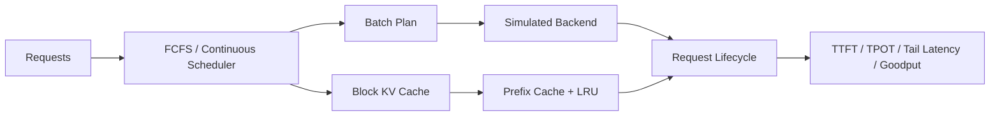

# LLM Inference Optimization and Serving Engine Lab

[](https://github.com/200lz/llm-inference-optimization-lab/actions/workflows/gcc.yml) [](https://github.com/200lz/llm-inference-optimization-lab/actions/workflows/clang.yml) [](https://github.com/200lz/llm-inference-optimization-lab/actions/workflows/python.yml)

Two complementary systems tracks examine LLM inference at different boundaries: **measured llama.cpp CPU profiling and hot-path optimization**, and a **simulated mini LLM serving engine for scheduling, KV-cache, prefix-cache, and workload analysis**. The first asks where real CPU time goes; the second isolates how serving policies interact under a deterministic model.

> [!IMPORTANT]
> **Evidence boundary**
> - CPU results are **MEASURED** on the documented AMD Ryzen 7 5800H / WSL2 environment.
> - Serving results are **SIMULATED** with a deterministic metadata and cost model.
> - No GPU, MN-Core, calibrated-accelerator, or production-serving performance claim is made.

## Overview

The CPU track uses a pinned [llama.cpp](https://github.com/ggml-org/llama.cpp) revision and Qwen2.5-0.5B-Instruct GGUF models. It covers llama.cpp benchmarking; prefill/decode characterization; F16, Q8_0, and Q4_K_M comparison; Linux `perf` profiling; assembly inspection; an extracted AVX2/F16C kernel experiment; and paired end-to-end validation.

The serving track is a dependency-free C++17 simulator with Python workload and analysis tools. It covers deterministic request replay; single-active FCFS; continuous batching; block-based KV allocation; exact full-block prefix caching; collision verification; reference counting; deterministic LRU; and TTFT, TPOT, P95/P99 latency, throughput, and SLO goodput.

Together, the tracks keep three boundaries explicit: real kernel measurements, extracted microbenchmark results, and modeled serving behavior are not interchangeable.

## Serving architecture



## Results
## Key implementation files

- [Continuous batching API](include/serving/continuous_batching.h)
- [Continuous batching engine](src/serving/continuous_batching.cpp)
- [KV and prefix-cache API](include/serving/kv_cache.h)
- [KV and prefix-cache implementation](src/serving/kv_cache.cpp)
- [Machine-readable benchmark runner](src/serving/serving_benchmark_runner.cpp)
- [Serving workload and metrics tools](benchmarks/serving/)
### Measured CPU inference highlights

| Evidence | Result | Scope |
| --- | --- | --- |
| **MEASURED** | Phase 4 prefill means: **48.556–194.256 tokens/s** | Q4_K_M, prompt 128/1024, 1–8 threads |
| **MEASURED** | Phase 4 generation means: **14.214–47.894 tokens/s** | Same matched thread-scaling rows and host |
| **MEASURED** | F16 / Q8_0 / Q4_K_M files: **1,266,425,696 / 675,710,816 / 491,400,032 bytes** | Exact GGUF artifacts |
| **MEASURED** | Q8_0 was **46.64% smaller** and Q4_K_M **61.20% smaller** than F16 | File storage, not runtime memory |
| **PROFILED** | Q8_0 executed **24.3% more instructions** than F16 | Matched whole invocation |
| **PROFILED** | Q4_K_M executed **56.7% more instructions** than F16 | Matched whole invocation |
| **PROFILED** | Q8_0 `tinyBLAS_Q0_AVX` accounted for **56.39%** of samples | Primary sampled workload |
| **MICROBENCHMARK** | Extracted Q8_0 RN=2 tile improved **1.32x at depth 28** and **1.34x at depth 152** | Bit-identical project-owned harness; not application throughput |
| **END-TO-END** | Prompt paired median **-1.571%**, bootstrap 95% CI **[-3.538%, +2.252%]** | 20 pairs; material drift; **inconclusive** |

The local AVX2/F16C change passed correctness, assembly, integration, and binary-provenance checks, but the final confidence interval crossed zero. No stable end-to-end speedup is claimed. See the [CPU final technical report](docs/final_report.md) and [paired A/B report](docs/results/phase8d_q8_end_to_end_ab.md).

### Simulated serving-engine highlights

| Configuration | Evidence | Completed | Request/s | P99 TTFT (us) | P99 E2E (us) | Prefix token hit rate |
| --- | --- | ---: | ---: | ---: | ---: | ---: |
| Single-active FCFS, chat | **SIMULATED** | 8/8 | 68.94 | 946 | 3,745 | N/A |
| Continuous batching, chat | **SIMULATED** | 8/8 | 67.97 | 521 | 6,230 | N/A |
| Shared-prefix cache off | **SIMULATED** | 8/8 | 110.20 | 556 | 2,592 | N/A |
| Shared-prefix cache on | **SIMULATED** | 8/8 | 110.69 | 536 | 2,272 | 0.88 |
| Eight-block KV pool | **SIMULATED** | 1/12 | 605.69* | 256* | 1,651* | N/A |

`*` The eight-block run completed one request, then recorded a KV-capacity deferral and stalled with 11 requests unfinished. Its rate uses only the completed request's full-drain window, and its latency population contains only that request; this is a stalled-capacity result, not a successful throughput result.

Under the selected synthetic coefficients, continuous batching reduced modeled chat P99 TTFT from 946 us to 521 us, but request throughput changed from 68.94 to 67.97 request/s and P99 end-to-end latency increased from 3,745 us to 6,230 us. Prefix caching saved 448 scheduled prefill tokens in the checked-in shared-prefix comparison. These are properties of the configured simulation, not predictions of real serving hardware. See the [serving final report](docs/serving/final_report.md) and [checked-in serving summary](results/serving/report.md).

## Engineering conclusions

- Smaller GGUF files did not automatically improve CPU throughput in the tested workloads.
- Prefill and decode responded differently to thread count, reinforcing the need to report them separately.
- Q8_0 and Q4_K_M achieved higher IPC than F16, but the additional instructions in the matched quantized workloads more than offset that advantage.
- A bit-identical **MICROBENCHMARK** improvement did not establish an **END-TO-END** improvement.
- Continuous batching improved **SIMULATED** TTFT in one chat workload, but did not improve request throughput and worsened P99 end-to-end latency under the selected costs.
- Exact full-block prefix caching reduced repeated **SIMULATED** prefill work on prefix-local traffic; mixed traffic showed a hit rate without an aggregate throughput gain.
- Small KV capacity can stall most requests; capacity above the tested working-set threshold was neutral in the compared runs.
- Negative, neutral, and inconclusive outcomes are preserved because optimization effects depend on workload, implementation, and measurement boundary.

These conclusions are conditional on the documented host, model, workload, and simulation configuration. They are not universal precision-format or scheduling claims.

## Project architecture

```text
.
├── benchmarks/serving/      # tracked deterministic workload inputs
├── configs/serving/         # serving policies, matrices, workload generators
├── include/serving/         # public C++17 serving interfaces
├── src/serving/             # simulator, schedulers, KV/prefix cache, native runner
├── docs/results/            # measured CPU phase reports
├── docs/serving/            # serving architecture, metrics, and design reports
├── results/serving/         # bounded portable SIMULATED references
├── kernels/                 # extracted correctness and microbenchmark harnesses
├── patches/                 # exported llama.cpp experiment patch
├── scripts/                 # build verification, profiling, and serving workflows
├── tests/                   # CTest and pytest coverage
└── third_party/llama.cpp    # pinned, unmodified Git submodule
```

Bounded, portable serving references are tracked with repository-relative provenance. Large or machine-local artifacts—including build trees, models, profiler captures, raw CPU benchmark output, and normal serving runs below `.artifacts/serving/`—remain ignored.

The serving data path is:

```text
versioned JSONL -> Python validation -> strict temporary TSV
  -> C++ FCFS or continuous engine -> typed JSONL records
  -> Python reconciliation, metrics, and provenance
```

## Quick start

Run commands from the repository root in Linux/WSL2.

### A. Model-free serving demo

No model download or network service is required after dependencies are available.

```bash
python -m venv .venv
source .venv/bin/activate
python -m pip install -r requirements.txt
git submodule update --init --recursive

cmake --preset debug
cmake --build --preset debug
scripts/run_serving_demo.sh
scripts/verify_serving_project.sh
```

The demo writes ordinary local output below ignored `.artifacts/serving/`. Updating a checked-in reference requires an explicit `--update-reference` option.

### B. CPU benchmark path

Prepare local GGUF files using [model setup](docs/model_setup.md), then build and test the project:

```bash
source .venv/bin/activate
git submodule update --init --recursive

cmake --preset debug
cmake --build --preset debug
ctest --preset debug --output-on-failure
python -m pytest
```

Build the pinned CPU-only llama.cpp Release targets using the [Release build guide](docs/llama_cpp_build.md), then verify them and run representative matrices:

```bash
python scripts/verify_llama_cpp_build.py

python benchmarks/run_llama_bench.py configs/cpu_baseline_q4.yaml
python benchmarks/run_llama_bench.py configs/prefill_decode_scaling.yaml
python benchmarks/run_llama_bench.py configs/quantization_comparison.yaml
python benchmarks/run_llama_bench.py configs/kv_cache_context_scaling.yaml
```

Use the [profiling environment guide](docs/profiling_environment.md) before collecting counters. Benchmark outputs are local and ignored; the tracked reports remain readable without model files.

## Methodology

The CPU harness fingerprints configurations, records warm-ups and repetitions, preserves failures and interrupted runs, and normalizes exact workload keys before comparison. The optimization study adds controlled source/binary provenance, deterministic output checks, assembly inspection, alternating paired measurements, and bootstrap confidence intervals. See [benchmark methodology](docs/benchmarking.md).

The serving harness uses integer simulated microseconds, checked arithmetic, stable request ordering, deterministic workload generation, closed record schemas, lifecycle reconciliation, and hashed configurations/workloads/native runners. Queue delay, TTFT, TPOT, end-to-end latency, nearest-rank percentiles, throughput, and conjunction-based goodput are derived only after native records reconcile. See [serving architecture](docs/serving/architecture.md) and [metric definitions](docs/serving/metrics.md).

## Completed phases

### CPU inference study

| Phase | Topic | Status | Main report |
| ---: | --- | --- | --- |
| 1 | Reproducible benchmark harness | Complete | [Methodology](docs/benchmarking.md) |
| 2 | Pinned CPU Release build verification | Complete | [Build verification](docs/llama_cpp_build.md) |
| 3 | Real Q4_K_M CPU baseline | Complete | [Baseline](docs/results/cpu_baseline_q4.md) |
| 4 | Prefill/decode and thread scaling | Complete | [Prefill/decode](docs/results/prefill_decode_scaling.md) |
| 5 | F16/Q8_0/Q4_K_M comparison | Complete | [Quantization](docs/results/quantization_comparison.md) |
| 6 | KV-cache and context scaling | Complete | [KV/context](docs/results/kv_cache_context_scaling.md) |
| 7 | CPU profiling and attribution | Complete | [CPU profiling](docs/results/cpu_profiling.md) |
| 8A | First hot-path candidate | Rejected at performance gate | [Rejected candidate](docs/results/q4_hotpath_optimization.md) |
| 8B | Q8_0 target selection | Complete | [Target selection](docs/results/phase8b_target_selection.md) |
| 8C | Extracted RN=2 optimization | Complete | [Kernel experiment](docs/results/phase8c_q8_rn2_scale.md) · [integration provenance](docs/results/phase8c_integration_provenance.md) |
| 8D | Binary and end-to-end A/B validation | Inconclusive | [Binary provenance](docs/results/phase8d_binary_provenance.md) · [paired A/B](docs/results/phase8d_q8_end_to_end_ab.md) |

### Mini LLM Serving Engine

| Phase | Topic | Status | Main report |
| ---: | --- | --- | --- |
| S0 | Architecture and metric contracts | Complete | [Architecture](docs/serving/architecture.md) · [metrics](docs/serving/metrics.md) |
| S1 | Deterministic simulation core | Complete | [Simulator](docs/serving/simulator.md) |
| S2 | Single-active FCFS | Complete | [Scheduler](docs/serving/scheduler.md) |
| S3 | Continuous batching | Complete | [Continuous batching](docs/serving/continuous_batching.md) |
| S4 | Block-based KV cache | Complete | [KV cache](docs/serving/kv_cache.md) |
| S5 | Exact full-block prefix cache | Complete | [Prefix cache](docs/serving/prefix_cache.md) |
| S6 | Workloads, metrics, and reporting | Complete | [Serving final report](docs/serving/final_report.md) |

The [documentation index](docs/README.md) links all detailed reports.

## Optimization case study

1. **PROFILED:** Q8_0 `tinyBLAS_Q0_AVX` represented 56.39% of samples in the primary workload.
2. A Q6_K/Q8_K accumulator candidate was bit-correct but [rejected](docs/results/q4_hotpath_optimization.md) after representative microbenchmarks regressed.
3. [Target selection](docs/results/phase8b_target_selection.md) identified RN=2 scale preparation; the extracted AVX2/F16C experiment packed two half-precision conversions.
4. **MICROBENCHMARK:** the bit-identical tile improved 1.32x–1.34x at observed depths, and assembly/integration/provenance checks passed.
5. **END-TO-END:** all 20-pair confidence intervals included zero and material temporal drift was detected.
6. The result remains inconclusive. The change is preserved as an [exported patch](patches/phase8c-q8-rn2-scale-preparation.patch), not applied to the pinned submodule.

## Relevance to accelerator-oriented serving

The serving layer makes execution control visible: arrivals, admission, iteration scheduling, and completion all have deterministic ownership. It separates prefill's larger parallel work from autoregressive decode, then exposes how scheduling policy, batch budgets, KV residency, prefix locality, and finite capacity affect throughput, TTFT, and tail latency.

The same concerns matter when a compiler, runtime, and accelerator must coordinate executable programs and memory residency. Useful policies depend on target program costs, launch behavior, supported shapes, memory capacity/bandwidth, and runtime constraints. Applying this simulator to GPU or MN-Core-like hardware would therefore require public target-specific measurement and cost-model calibration; no proprietary MN-Core knowledge is assumed.

## What this project demonstrates

- C++17 systems programming and lifecycle design
- Deterministic request scheduling and continuous batching
- KV-cache ownership, capacity accounting, and fragmentation analysis
- Prefix-cache hashing, collision verification, reference counting, and LRU
- Strong exception guarantees and invariant-driven testing
- Workload design and service-level performance analysis
- Clear separation between measured, simulated, and inconclusive evidence
## Limitations

### CPU study

- One AMD Ryzen 7 5800H host under WSL2, one small Qwen2.5 model family, and one pinned llama.cpp revision.
- CPU-only execution with uncontrolled frequency, temperature, host scheduling, power state, and page-cache effects.
- Virtualized and incomplete `perf` event support; RSS is not exact model or KV-cache memory.
- Limited synthetic shapes; the extracted optimization did not demonstrate a stable end-to-end gain.

### Serving simulator

- Metadata and a linear educational cost model only: no tensors, tokenizer, model kernels, calibrated hardware timing, or byte-level KV layout.
- No networking, production API, threads, distributed execution, preemption, swapping, chunked prefill, or partial-block reuse.
- Synthetic workloads and SLOs are not production traces or recommendations.
- Stalled runs do not autonomously recover; modeled findings require validation on a real backend and target hardware.

## Future work

- Add a real llama.cpp backend adapter without modifying the pinned submodule.
- Compare the simulator and measured concurrency behavior with `llama-server`.
- Calibrate the cost model on a declared target and report held-out error and sensitivity.
- Repeat CPU experiments with larger models and stronger controls on native Linux.
- Replay real, appropriately sanitized request traces and longer steady-state workloads.
- Extend kernel and serving profiling to CUDA/NVIDIA hardware.
- Turn a stable, reproducible finding into an upstream issue or pull request.

## License

MIT. See [LICENSE](LICENSE).
