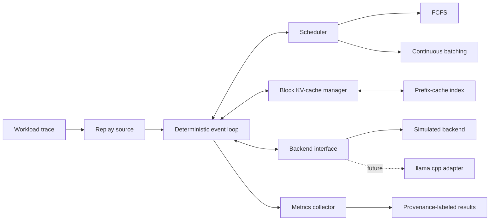
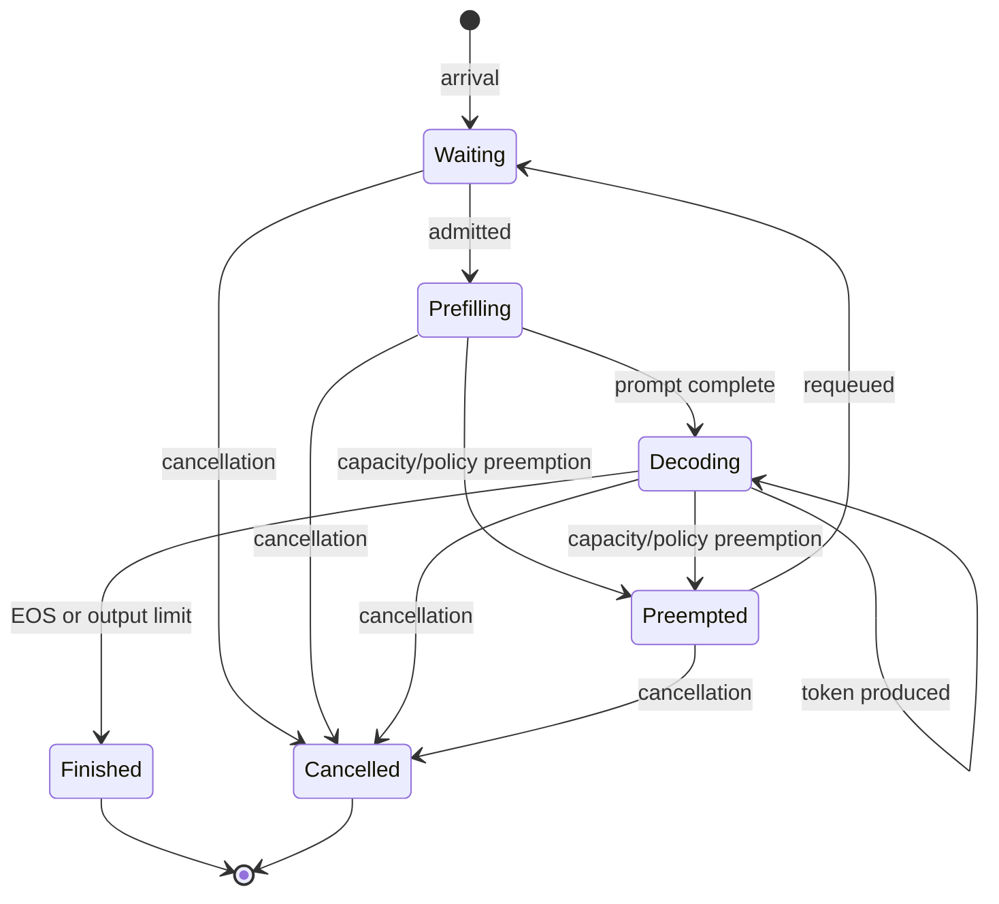

# Serving simulator architecture

## Purpose and boundaries

The mini serving engine is a deterministic C++17 simulator for studying how request scheduling, continuous batching, and block-based KV-cache pressure affect user-visible latency and aggregate throughput. It extends the repository from single-invocation CPU inference measurements to multi-request serving experiments without pretending that modeled time is hardware time.

The simulator is useful on a CPU-only WSL2 host because scheduler and cache policies can be tested quickly, reproducibly, and at workload scales that would be expensive to explore with real inference. Existing llama.cpp CPU measurements can calibrate the cost model. The simulator cannot predict GPU kernels, memory transfers, contention, or framework overhead unless those effects are explicitly calibrated and validated.

This design borrows concepts used by vLLM- and SGLang-style systems—iteration-level scheduling, continuous batching, paged/block-oriented KV storage, prefix reuse, preemption, and workload-level serving metrics. It is an educational model of those concepts, not an implementation of either project and not a claim of feature or performance parity.

Phase S2 implements the deterministic single-active FCFS subset of this design.
Phase S3 adds a separate deterministic `ContinuousBatchingEngine` for
iteration-level multiple-active execution while preserving that reference path.
The block cache, prefix cache, preemption, workload replay, and llama.cpp
adapter shown here remain future architecture.

## System context



The event loop owns simulated time and request state. Schedulers make policy decisions but do not advance time or mutate cache storage directly. The KV-cache manager owns block allocation and reference counts. Backends accept a selected batch and return completion events or observations. Metrics consume immutable lifecycle events rather than influencing scheduling.

## Request model and lifecycle

Each request has a stable ID, arrival time, prompt token IDs (or a token-count-only synthetic prompt), maximum output length, optional cancellation time, and optional service-level objectives. Runtime data includes state, generated-token count, reusable-prefix length, allocated block IDs, scheduling epochs, and lifecycle timestamps.



`Preempted` is an observable transition state: the request records a preemption, releases or preserves blocks according to the configured policy, and is requeued as `Waiting` at the same simulated timestamp. `Finished` and `Cancelled` are terminal. Invalid transitions fail the simulation instead of being silently repaired.

## Core abstractions

### Scheduler and execution modes

The Phase S2 `Scheduler` receives immutable request IDs and arrival timestamps
through lifecycle notifications and returns an explicit admission decision. It
does not own or mutate requests. The future multi-active scheduler will receive
an immutable `SchedulingSnapshot` containing ready requests, active sequences,
cache capacity, and backend limits and will expand decisions to prefill chunks,
decode steps, and preemptions. Stable request ID breaks all policy ties.

- `FcfsScheduler` orders by `(arrival_time, request_id)`, never bypasses a capacity-blocked head request, and runs admitted work without policy preemption. This intentionally exposes head-of-line blocking as the simple reference policy; requests that can never fit are rejected during validation.
- Phase S3 deliberately does not retrofit the event-oriented scheduler
  interface. `ContinuousBatchingEngine` constructs immutable plans for either
  `DecodeFirst` or `FcfsMixed`, executes full prefills and one-token decode
  steps atomically per iteration, and records a deterministic trace. It has no
  cache-capacity input or preemption. A future cache-aware scheduler can receive
  block pressure after the Phase S4 KV manager exists.

Phase S3 policy configuration records maximum sequences and maximum tokens per
iteration. Prefill chunk size, cache watermarks, and preemption mode remain
future configuration.

The Phase S3 sequence limit counts only work selected for the current
iteration; it is not resident decode or KV capacity. Its engine prepares
request, statistic, time, and trace results transactionally before publishing
one iteration. Synchronous cancellation likewise preflights all throwing work
before mutation.

### Backend

The Phase S2 `Backend` exposes separate prefill/decode estimates. The Phase S3
engine borrows `SimulatedBackend` for its mixed-batch estimate. A future
generalized backend may accept `BatchPlan` directly; scheduler code never calls
llama.cpp APIs.

- `SimulatedBackend` computes integer durations from explicit cost parameters.
  S3 adds a checked linear mixed-batch estimate from prefill tokens, decode
  sequence count, and scheduled sequence count while preserving the S1/S2
  APIs. The backend does not execute a model.
- `LlamaCppBackend` is a future adapter outside the pinned submodule. It will translate plans to supported llama.cpp batching/context operations and report monotonic-clock observations. Adapter limitations must be surfaced as capabilities rather than emulated invisibly.

An analytical cost calculation may be used inside `SimulatedBackend`, but an analytical estimate remains distinct from the resulting discrete-event experiment; both carry provenance as defined below.

### Block-based KV-cache manager

`KvCacheManager` divides logical KV capacity into fixed-size token blocks. It provides deterministic allocate, append, retain, release, and capacity-query operations. A request maps logical token ranges to block IDs; the final block may be partially filled, but capacity accounting charges a full block. All block selection uses the lowest available block ID.

Prefix-owned blocks are immutable and reference-counted. Request-private blocks become reclaimable on finish or cancellation. On preemption, the configured policy either swaps no data and releases all private blocks (`recompute`) or retains blocks while the request waits (`retain`); the first implementation should support `recompute` only and make that limitation explicit. Internal invariants include unique ownership records, nonnegative reference counts, and `allocated <= capacity` after every event.

### Prefix cache

`PrefixCache` maps a collision-checked token-prefix key to immutable, block-aligned KV block chains and supports longest-prefix lookup. Hits require the same backend/model identity, tokenization identity, KV layout, block size, and relevant model/runtime configuration. Only complete blocks are reusable initially; unmatched and partial-block suffixes are prefilled normally. Deterministic LRU eviction uses `(last_access_time, insertion_sequence, key)`.

The abstraction deliberately separates lookup policy from block storage so later experiments can compare disabled caching, exact-prefix caching, and alternative eviction policies without changing the scheduler.

### Workload replay

`WorkloadSource` yields arrivals and cancellations from either a generated workload or a versioned trace. The first trace format should be dependency-free CSV with integer time units, request ID, prompt length or token-file reference, output limit, optional cancellation time, and optional SLO fields. Replay preserves trace arrival gaps; a scale factor may transform all gaps using documented integer rounding. The resolved trace, simulator configuration, seed, and schema version form the run fingerprint.

Synthetic token-count-only requests cannot produce genuine prefix hits. Prefix-cache experiments therefore require explicit token sequences or stable content hashes with collision-check data.

## Future deterministic event semantics

The priority model in this section is a future target. Phase S2 currently uses
`(timestamp_us, event_sequence)`, drains the entire timestamp, and exposes only
external cancellation between timestamp boundaries. It does not yet have a
cancellation `EventType`; see [the Phase S2 simulator](simulator.md).

Simulated time is an integer tick type (`std::int64_t`), with the tick unit stored in run metadata. Floating-point durations are converted once at configuration load using a documented rounding rule. The priority queue key is:

`(timestamp, event_priority, monotonic_event_sequence)`.

In the future target, arrivals are registered first, cancellation events are applied second, and backend completions third; then the scheduler runs once against the resulting state. Thus a request may arrive and be cancelled at the same timestamp, cancellation at the exact completion timestamp wins, a late completion for a cancelled request is ignored but audited, and new arrivals cannot retroactively join a completing batch. Event sequence makes repeated events stable. No wall clock, thread scheduling, unordered-container iteration, or random device may affect a simulated run; any stochastic generator uses an explicit seed and stable algorithm identifier.

The loop jumps directly to the next event timestamp. Backend work is non-preemptible within one submitted iteration; preemption occurs only at iteration boundaries. Every state change emits an append-only event record suitable for replay and invariant checking.

## Result provenance

Every output row and summary must carry exactly one evidence kind:

| Kind | Meaning | Permitted claim |
| --- | --- | --- |
| `simulated` | Observed from a discrete-event run using a named scheduler, workload, and cost model | Behavior of that configured simulation |
| `analytical_estimate` | Computed directly from a formula or fitted model without executing inference | Model prediction only |
| `llama_cpp_measurement` | Timed from the future adapter or existing llama.cpp benchmark with recorded hardware/software provenance | Behavior of that measured setup |

Charts must not join these kinds into an unlabeled series. Calibration input remains a `llama_cpp_measurement`; a simulation using it still produces `simulated` results. See [metrics](metrics.md) for metric semantics.

## Proposed implementation layout and namespaces

The exact future layout is:

```text
include/llm_lab/serving/
├── backends/
│   ├── llama_cpp_backend.h         # future, optional target
│   └── simulated_backend.h
├── schedulers/
│   ├── continuous_batching_scheduler.h
│   └── fcfs_scheduler.h
├── backend.h
├── event.h
├── kv_cache.h
├── metrics.h
├── prefix_cache.h
├── request.h
├── scheduler.h
├── simulator.h
├── types.h
└── workload.h
src/serving/
├── backends/
│   ├── llama_cpp_backend.cpp       # future, optional target
│   └── simulated_backend.cpp
├── schedulers/
│   ├── continuous_batching_scheduler.cpp
│   └── fcfs_scheduler.cpp
├── kv_cache.cpp
├── metrics.cpp
├── prefix_cache.cpp
├── request.cpp
├── serving_sim_main.cpp
├── simulator.cpp
└── workload.cpp
tests/native/serving/
├── test_event_order.cpp
├── test_kv_cache.cpp
├── test_metrics.cpp
├── test_prefix_cache.cpp
├── test_schedulers.cpp
├── test_simulator.cpp
└── test_workload.cpp
benchmarks/serving/
├── README.md
└── workloads/                    # versioned input traces, never fabricated results
configs/serving/
├── fcfs.example.cfg
└── continuous_batching.example.cfg
```

Public API types use `llm_lab::serving`. Concrete policies use `llm_lab::serving::schedulers`, backend implementations use `llm_lab::serving::backends`, and test-only helpers use `llm_lab::serving::test`. Cache, simulation, workload, and metrics types remain in `llm_lab::serving` to avoid namespaces containing only one implementation. File names are snake_case, types are `UpperCamelCase`, functions are `lower_snake_case`, and durations use strong aliases rather than bare floating-point values.

The future CMake target names are `llm_lab_serving`, `serving_sim`, and `serving_tests`. `llm_lab_serving` remains independent of llama.cpp; an opt-in `llm_lab_llama_cpp_backend` target owns the adapter dependency.

## Explicit non-goals

- Network protocols, HTTP serving, authentication, distributed execution, and multi-model routing.
- CUDA kernel, GPU memory, tensor-parallel, speculative-decoding, or production fault modeling.
- Bit- or time-accurate emulation of llama.cpp, vLLM, or SGLang.
- Treating simulation output as a benchmark measurement.
